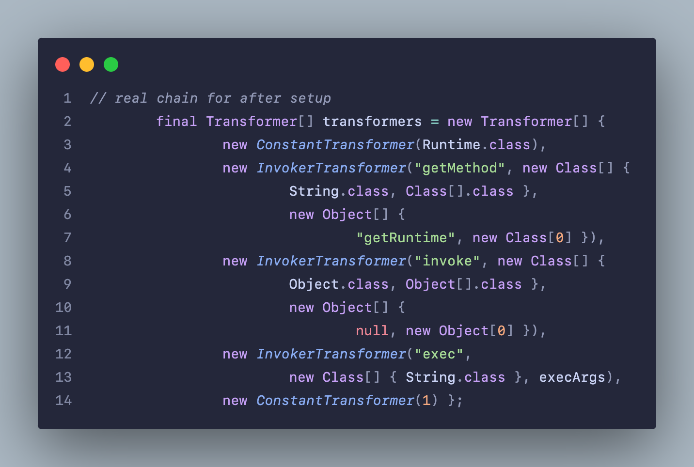
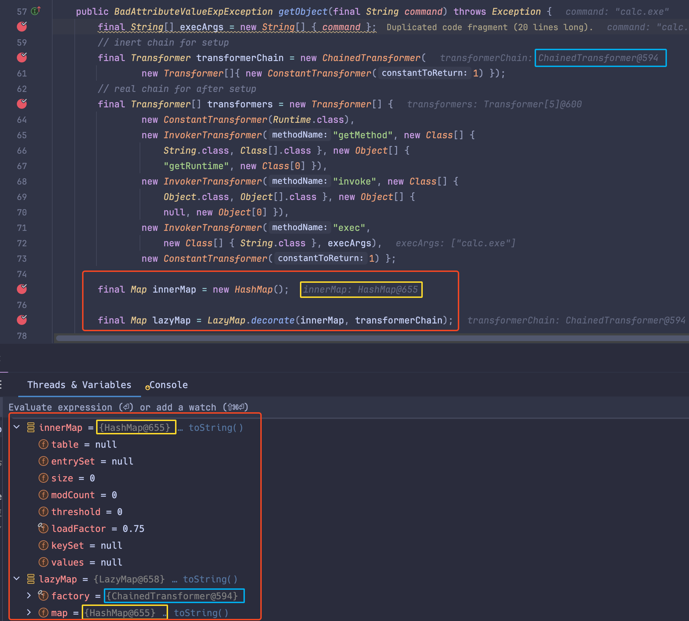
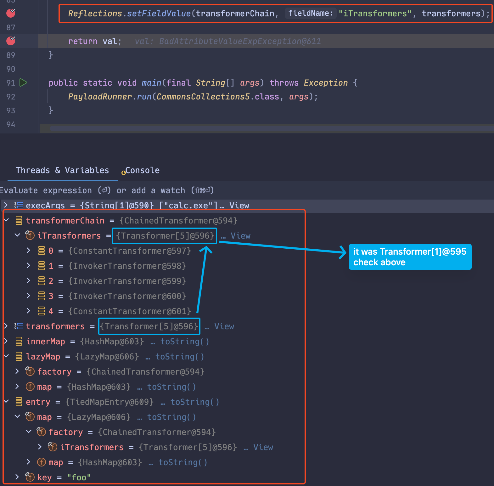
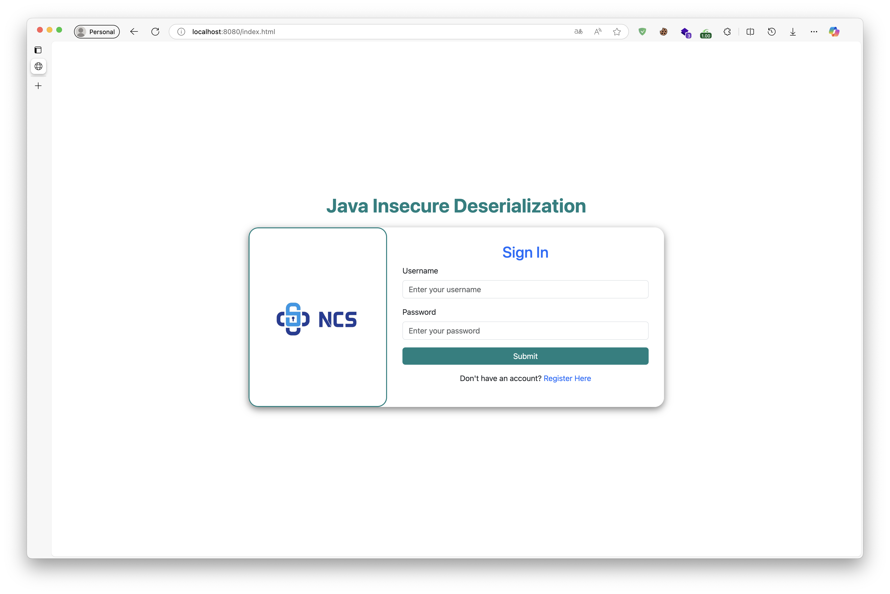
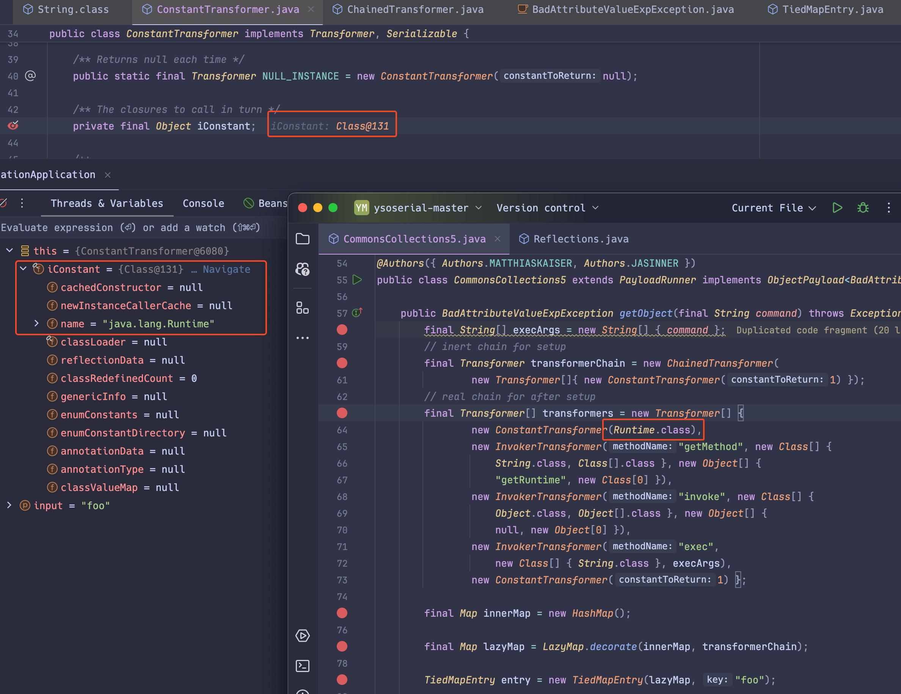

<div align="center">

# Java Insecure Deserialization Report

</div>

# **1. Giới thiệu**

Trong Java, `serialization` là quá trình chuyển đổi một đối tượng thành luồng byte để lưu trữ hoặc truyền tải, trong khi `deserialization` là quá trình khôi phục đối tượng từ luồng byte đó. Cơ chế này hỗ trợ hiệu quả việc trao đổi dữ liệu giữa các hệ thống hoặc duy trì trạng thái đối tượng. Tuy nhiên, nếu không được triển khai an toàn, nó có thể dẫn đến lỗ hổng `insecure deserialization`, tạo điều kiện cho kẻ tấn công khai thác hệ thống.

Báo cáo này sẽ mô tả chi tiết:

- Nguyên nhân dẫn đến `insecure deserialization`.

- Xây dựng một ứng dụng Java chứa lỗ hổng deserialization.

- Trình bày quy trình khai thác bằng `ysoserial` và phân tích `gadget-chain` dẫn đến RCE.

- Các bước debug luồng thực thi chi tiết trong `gadget-chain`.

- Đề xuất biện pháp phòng ngừa để bảo vệ hệ thống trước các cuộc tấn công qua `deserialization`.

---

# **2. Lỗ hổng Deserialization trong Java là gì?**

Lỗi `insecure deserialization` xảy ra khi một ứng dụng Java deserialize dữ liệu đầu vào không đáng tin cậy (thường do người dùng cung cấp) mà không có cơ chế kiểm soát hoặc xác thực phù hợp. Điều này cho phép kẻ tấn công thao túng các đối tượng đã được serialize, đưa dữ liệu độc hại vào mã ứng dụng, thậm chí thay thế đối tượng ban đầu bằng một đối tượng thuộc lớp hoàn toàn khác. Đáng chú ý, trong quá trình deserialization, bất kỳ lớp nào có sẵn trong classpath của ứng dụng đều có thể được giải mã và khởi tạo, bất kể lớp đó có được mong đợi hay không. Do đó, lỗ hổng này đôi khi còn được gọi là `object injection`.

## **2.1 Ảnh hưởng của Lỗ hổng Deserialization**

Lỗ hổng `insecure deserialization` có thể gây hậu quả nghiêm trọng bằng cách mở rộng diện tích tấn công của ứng dụng. Nó cho phép kẻ tấn công lợi dụng mã hiện có theo cách nguy hiểm, dẫn đến nhiều loại lỗ hổng khác, phổ biến nhất là thực thi mã từ xa (RCE).

Ngay cả khi RCE không khả thi, lỗ hổng này vẫn có thể bị khai thác để thực hiện leo thang đặc quyền, truy cập tệp trái phép, hoặc gây ra các cuộc tấn công từ chối dịch vụ (DoS).

## **2.2 Ví dụ về Lỗi Deserialization trong Java**

Một ví dụ điển hình là việc sử dụng các đối tượng không an toàn như **`ObjectInputStream.readObject()`** mà không kiểm tra loại đối tượng được gửi vào. Khi một đối tượng không xác thực được deserialized, attacker có thể thay đổi loại class của đối tượng và tiêm mã thực thi.

```java
ObjectInputStream ois = new ObjectInputStream(inputStream);
MyObject obj = (MyObject) ois.readObject();  // Đây là nơi xảy ra lỗi nếu không kiểm tra dữ liệu đầu vào.
```

# **3. Xây dựng ứng dụng chứa lỗi**

## **3.1. Thông tin chung về ứng dụng**

- **Tên ứng dụng:** Java Insecure Deserialization
- **Mục đích:**  
  Ứng dụng được xây dựng nhằm mục đích tìm hiểu và phân tích lỗ hổng _insecure deserialization_ trong Java, cũng như phân tích gadget-chain được tạo ra từ công cụ _ysoserial_.

- **Môi trường & Công nghệ sử dụng:**
  - **Ngôn ngữ:** Java (phiên bản 8)
  - **Project management:** Apache Maven
  - **Framework:** Spring Boot 2.7.18
  - **Máy chủ:** Embedded Tomcat (tích hợp trong Spring Boot)
  - **Công nghệ liên quan:** Servlet (dùng để tương tác với cookie)
  - **Môi trường:** Local

---

## **3.2. Chi tiết về Endpoint bị ảnh hưởng và luồng hoạt động**

Ứng dụng được xây dựng dưới dạng một trang web đăng ký và đăng nhập đơn giản, với 4 endpoint chính như sau:

1. **/register:**

   - **Chức năng:** Cho phép người dùng đăng ký tài khoản.
   - **Xử lý:** Dữ liệu đăng ký được lưu vào một _HashMap_ (không dùng database, chỉ để tạm thời).

2. **/login:**

   - **Chức năng:** Cho phép người dùng đăng nhập.
   - **Xử lý:**
     - Sau khi đăng nhập thành công, trang web tạo ra một cookie có tên **user_session**.
     - Giá trị của cookie là tên đăng nhập (username) được _serialize_ và sau đó _base64_.

3. **/home:**

   - **Chức năng:** Trang chủ hiển thị nội dung "Hello [username]".
   - **Xử lý:**
     - Kiểm tra sự tồn tại của cookie _user_session_.
     - Nếu không có cookie, trả về Forbidden.
     - Nếu có, cookie được decode base64, sau đó được deserialize để lấy ra tên username. Nếu cookie được deserialize ra giá trị hợp lệ sẽ hiển thị nội dung "Hello [username]", ngược lại sẽ hiển thị "Cookie không hợp lệ".

4. **/logout:**
   - **Chức năng:** Xóa cookie và chuyển hướng người dùng về trang đăng nhập.

---

## **3.3. Đoạn mã nguồn gây ra lỗ hổng**

Ứng dụng sử dụng `Apache Commons Collections 3.1`, một thư viện cũ chứa lỗ hổng đã được biết đến, gadget-chain đã được nghiên cứu và khai thác. Sử dụng công cụ **ysoserial** với option _CommonsCollections5_, _CommonsCollections6_ hoặc _CommonsCollections7_ sẽ giúp tạo ra payload để khai thác lỗ hổng này. **Trong report này ta sẽ phân tích gadget-chain của _CommonsCollections5_**.

Ở endpoint `/login` và `/home`, quá trình xử lý cookie bị ảnh hưởng bởi việc deserialize mà không có biện pháp kiểm tra an toàn. Đoạn code xử lý cookie dưới đây:


<div align="center">

_Method Serialize và Deserialize sau đó base64_

</div>
<br><br>


<div align="center">

_Endpoint /login và /home_

</div>

Khi đăng nhập thành công, một cookie có tên _user_session_ sẽ được tạo với giá trị là _username_ đi qua method _serializeToBase64_, sau đó endpoint /home sẽ xử lý giá trị cookie đó, nếu có giá trị, giá trị đó sẽ đi qua method _deserialFromBase64_ mà không qua validation hoặc blacklist các class hợp lệ khi thực hiện _readObject()_ dẫn đến việc hacker chèn được payload qua giá trị cookie đó.

## **3.4. Thông tin hỗ trợ**

#### Sử dụng ysoserial

- Sử dụng tool **ysoserial** với option **CommonsCollection5 (6, 7)** để tạo payload độc hại. Lưu ý là để tạo được payload cần dùng JDK8.
- Payload được tạo ra sau đó được _base64_ và thay đổi giá trị cookie **user_session** khi đăng nhập thành công.

#### Exploit

- Mặc dù giao diện hiển thị thông báo _"cookie không hợp lệ"_, backend vẫn tiến hành **deserialize** cookie và thực thi gadget-chain thành công.
- Quá trình debug (đặt breakpoint trong IDE) giúp quan sát luồng thực thi:
  1. **Deserialize giá trị từ cookie**
  2. **Tải và thực thi chuỗi gadget** (gọi đến `Runtime.getRuntime().exec()`)

---

# **4. Phân tích Gadget-chain CommonsCollections5**

## **4.1. Gadget-chain là gì?**

Trong ngữ cảnh **Insecure Deserialization**, **gadget-chain** là một chuỗi các đối tượng được liên kết với nhau một cách đặc biệt. Mỗi đối tượng trong chuỗi này chứa một "gadget", là một đoạn mã nhỏ có thể thực hiện một hành động cụ thể. Kẻ tấn công sẽ tạo ra một chuỗi các gadget đã được tuần tự hóa, và khi ứng dụng giải mã chuỗi này, các gadget sẽ được thực thi theo một thứ tự nhất định, dẫn đến việc thực hiện một hành động nguy hiểm, chẳng hạn như RCE.

## **4.2. Phân tích chi tiết**


<div align="center">

_Gadget-Chain CommonsCollections5_

</div>
<br></br>


<div align="center">

_Đoạn code tạo ra payload_

</div>

---

### #1 Command được truyền vào


Đối tượng `execArgs` được tạo với kiểu String có giá trị là `command` do người dùng truyền vào, tùy vào câu lệnh mà người tạo payload muốn thực thi.


---

### #2 Khởi tạo Transformer


`Transformer` là một interface có phương thức `transform(Object input)`, nó nhận đầu vào là một giá trị rồi trả ra một giá trị khác. Ở đây đối tượng `transformerChain` được khởi tạo là một `ChainedTransformer` là một lớp con của Transformer, chứa một `ConstantTransformer(1)`. `ChainedTransformer` là một Transformer đặc biệt, nó nhận vào một danh sách `Transformer[]` và gọi lần lượt từng Transformer.

Ban đầu ta chỉ khởi tạo `ConstantTransformer(1)`, vì nó chỉ trả về 1 nên vô hại, tránh thực thi payload ngay, sau đó ta sẽ đổi nó thành payload thực sự sau.


---

### #3 Chuỗi Transformer thực


Đối tượng `transformers` được khởi tạo là một mảng Transformer[] với 5 Transformer thành phần, lần lượt là:

```java
new ConstantTransformer(Runtime.class)
```

`ConstantTransformer` là một Transformer trả về một giá trị nhất định, ở đây nó trả về `Runtime.class`


<div style="width: 350px; height: 0.5px; background-color: black; margin: 15px auto;"></div>

```java
new InvokerTransformer("getMethod", new Class[] {
						String.class, Class[].class },
						new Object[] {
								"getRuntime", new Class[0] })
```

Tiếp theo `InvokerTransformer` sẽ lấy phương thức `getRuntime()` của class `Runtime`. Cấu trúc của `InvokerTransformer` là

```java
new InvokerTransformer(methodName, paramTypes, args)
```

`methodName`: Tên phương thức cần gọi.

`paramTypes`: Danh sách kiểu dữ liệu của các tham số.

`args`: Danh sách các giá trị đối số.

- **`methodName`**:

Trong đoạn code tạo payload, `methodName` là `"getMethod"`, nó là một method của class `Class` có tác dụng gọi một phương thức trên một đối tượng.

<br>

- **`paramTypes`**:

Đây là danh sách các kiểu dữ liệu của tham số mà phương thức `"getMethod"` yêu cầu. Phương thức `getMethod()` có định nghĩa như sau trong java:

```java
Method getMethod(String name, Class<?>... parameterTypes)
```

`String name`: Tên phương thức cần tìm ("getRuntime").

`Class<?>... parameterTypes`: Danh sách kiểu dữ liệu của tham số của phương thức cần tìm.

Trong đoạn code, `paramTypes` là

```java
new Class[] { String.class, Class[].class }
```

`String.class`: Kiểu dữ liệu của tham số đầu tiên ("getRuntime" - tên phương thức).

`Class[].class`: Kiểu dữ liệu của tham số thứ hai (new Class[0] - danh sách tham số của phương thức đó).

<br>

- **`args`**:

```java
new Object[] { "getRuntime", new Class[0] }
```

`"getRuntime"`: Chuỗi tên phương thức cần tìm trong `Runtime.class`.

`new Class[0]`: Danh sách tham số của phương thức `getRuntime()`, ở đây nó không có tham số nên truyền vào một mảng rỗng (`new Class[0]`).

Sau khi chạy qua `InvokerTransformer` này, nó trả ra `Runtime.getRuntime()` để chuẩn bị gọi method `exec`.


<div style="width: 350px; height: 0.5px; background-color: black; margin: 15px auto;"></div>

```java
new InvokerTransformer("invoke", new Class[] {
						Object.class, Object[].class },
						new Object[] {
								null, new Object[0] })
```

Chức năng và cấu trúc vẫn giống như `InvokerTransformer` ở trên, lần này nó có nhiệm vụ thực thi `Runtime.getRuntime()` để lấy đối tượng `Runtime`.


<div style="width: 350px; height: 0.5px; background-color: black; margin: 15px auto;"></div>

```java
new InvokerTransformer("exec", new Class[] { String.class }, execArgs)
```

Với `InvokerTransformer` cuối cùng, nó gọi method `exec()` của đối tượng `Runtime` (`Runtime().getRuntime().exec(command)` hay `Runtime().exec(command)`)để thực thi command được truyền vào.


<div style="width: 350px; height: 0.5px; background-color: black; margin: 15px auto;"></div>

```java
new ConstantTransformer(1)
```

_ConstantTransformer_ cuối cùng trả về **1** để kết thúc và tránh lỗi.


---

### #4. Tạo LazyMap và TideMapEntry


```java
final Map innerMap = new HashMap();
final Map lazyMap = LazyMap.decorate(innerMap, transformerChain);
```

Trong thư viện _Apache Commons Collections_, `LazyMap` là một class, nó hoạt động như một `Map` thông thường nhưng có thể sinh ra giá trị tự động khi một key không tồn tại. Khi truy cập một key chưa có trong `LazyMap`, nó sẽ gọi `Transformer` để tạo giá trị mới.

Đối tượng `innerMap` là một `HashMap` thông thường, ban đầu rỗng và không có bất kỳ cơ chế đặc biệt nào. Method `LazyMap.decorate(innerMap, transformerChain)` wrap `innerMap` thành một `LazyMap`. Đối tượng `lazyMap` nhận được là một LazyMap, trong đó:

- Dữ liệu thực tế vẫn được lưu trữ trong `innerMap`.
- `transformerChain` đóng vai trò là factory: Khi một key không tồn tại trong innerMap, thay vì trả về null, LazyMap sẽ gọi `transformerChain.transform(key)` để tạo giá trị tương ứng. Ban đầu, `transformerChain` chỉ là một chain giả, chỉ trả về `1`, nhưng sẽ được thay đổi với chain thật sau.



<div style="width: 350px; height: 0.5px; background-color: black; margin: 15px auto;"></div>

```java
TiedMapEntry entry = new TiedMapEntry(lazyMap, "foo");
```

`TiedMapEntry` cũng là một class trong `Apache Commons Collections`, được thiết kế để liên kết một Map với một key cụ thể. Đối tượng `entry` được tạo là một `TiedMapEntry` để kết nối `lazyMap` với key `"foo"`. Khi `entry.toString()` được gọi, nó sẽ gọi `lazyMap.get()` vì key "foo" chưa tồn tại và `transformerChain.transform()` sẽ được gọi, kich hoạt gadget-chain.


---

### #5. Gán vào `BadAttributeValueExpException` để kích hoạt tự động


```java
BadAttributeValueExpException val = new BadAttributeValueExpException(null);
```

`BadAttributeValueExpException` là một class trong Java, được sử dụng khi có lỗi trong giá trị thuộc tính. `val` là một đối tượng của lớp này. Ở đây, khi khởi tạo đối tượng `val`, ta truyền `null` vào, vì giá trị này sẽ được thay đổi sau để ghi đè method `toString()` dẫn đến `toString()` của `TiedMapEntry` được kích hoạt.


<div style="width: 350px; height: 0.5px; background-color: black; margin: 15px auto;"></div>

```java
Field valfield = val.getClass().getDeclaredField("val");
```

Đối tượng `valfield` thuộc class `Field`, method `getClass()` sẽ trả về đối tượng Class đại diện cho Class của `val`(BadAttributeValueExpException). Method `getDeclaredField(String fieldName)` là một phương thức của class `Class`, giúp lấy thông tin về một field cụ thể trong class. Nó trả về một đối tượng Field chứa thông tin về field "val", dù nó có là private, protected hay public.


<div style="width: 350px; height: 0.5px; background-color: black; margin: 15px auto;"></div>

```java
Reflections.setAccessible(valfield);
```

Method `setAccessible()` trong `Reflections.java` (thuộc ysoserial) có nhiệm vụ bỏ giới hạn truy cập của Java, giúp ta có thể chỉnh sửa giá trị của một trường private. Mã nguồn của method `setAccessible` trong `Reflections.java`:

```java
public static void setAccessible(AccessibleObject member) {
        String versionStr = System.getProperty("java.version");
        int javaVersion = Integer.parseInt(versionStr.split("\\.")[0]);
        if (javaVersion < 12) {
            Permit.setAccessible(member);
        } else {
            member.setAccessible(true);
        }
    }
```

Method `setAccessible()` là một wrapper gọi `setAccessible(true)` từ Java gốc (`AccessibleObject.java`). Wrapper này đơn giản hóa việc vượt qua giới hạn truy cập trên các phiên bản Java khác nhau. Trong khi đó, `setAccessible(true)` gốc tích hợp các kiểm tra bảo mật để ngăn chặn truy cập trái phép.

- Với Java phiên bản < 12, `setAccessible(member)` gọi `Permit.setAccessible(member)` để bỏ giới hạn truy cập mà không gây cảnh báo runtime.
- Từ Java 12 trở đi, `member.setAccessible(true)` được gọi trực tiếp. Tuy nhiên, do hệ thống module (JPMS) tăng cường bảo mật, `Permit` trở nên không còn cần thiết và kém hiệu quả. Lúc này, `setAccessible(true)` chỉ hoạt động khi không bị chặn bởi `SecurityManager` hoặc các hạn chế của JPMS (như module không mở).

`setAccessible()` được gọi ở đây giúp có thể thay đổi giá trị của trường private `val`.


<div style="width: 350px; height: 0.5px; background-color: black; margin: 15px auto;"></div>

```java
valfield.set(val, entry);
```

Method `set(Object obj, Object value)` của class `Field` đặt giá trị của field `val` trong đối tượng `val` thành `entry`. `entry` trước đó đã được gán là một `TiedMapEntry`.


<div style="width: 350px; height: 0.5px; background-color: black; margin: 15px auto;"></div>

```java
Reflections.setFieldValue(transformerChain, "iTransformers", transformers);
```

Mã nguồn của method `setFieldValue()` trong `Reflections.java`:

```java
public static void setFieldValue(final Object obj, final String fieldName, final Object value) throws Exception {
        final Field field = getField(obj.getClass(), fieldName);
        field.set(obj, value);
    }
```

`setFieldValue(obj, fieldName, value)` có chức năng chính tìm và thay đổi giá trị của một trường private hoặc protected - những field mà bình thường không thể truy cập từ bên ngoài class - trong một object. Trong trường hợp này, nó đặt giá trị của `iTransformers` trong `transformerChain` (chain giả) thành `transformers` (chain thật).



### #6. Kết thúc

Khi payload được đưa vào `readObject()`, diễn biến sẽ là:

1. `val.toString()` được gọi

2. `entry.toString(` được gọi

3. `lazyMap.get("foo")` được gọi

4. `transformers.transform("foo")` được gọi

5. `ChainedTransformer` thực thi từng bước:

   - Runtime.class

   - .getMethod("getRuntime")

   - .invoke(null) → Runtime.getRuntime()

   - .exec(command) → Thực thi command.

---

# **5. Tạo payload với ysoserial**

`ysoserial` là một công cụ mã nguồn mở giúp tạo ra các payload khai thác lỗ hổng insecure deserialization trong các ứng dụng Java. Công cụ này chứa nhiều gadget-chain dựa trên các thư viện phổ biến, cho phép kẻ tấn công RCE nếu ứng dụng mục tiêu không có cơ chế kiểm soát deserialization an toàn.

## **5.1. Xác định gadget-chain phù hợp**

Trước khi tạo payload, cần xác định thư viện có trong ứng dụng mục tiêu bằng cách kiểm tra classpath, thư mục WEB-INF/lib, hoặc tệp pom.xml. Ví dụ, nếu ứng dụng sử dụng Commons Collections 3.1, ta có thể dùng gadget CommonsCollections5, 6 hoặc 7.

## **5.2. Tạo payload**

Cấu trúc câu lệnh:

```sh
java -jar ysoserial-[version]-all.jar [payload] '[command]'
```

- java: Cần sử dụng JDK 8 để đảm bảo tương thích.

- payload: Loại gadget-chain phù hợp với ứng dụng mục tiêu.

- command: Lệnh hệ thống sẽ được thực thi khi payload được deserialized.

Lấy ví dụ với `CommonsCollections5` được phân tích trong report này, trong ứng dụng web sử dụng `Apache Commons Collection 3.1` nên nó hợp lệ, ta sẽ có câu lệnh:

```sh
java8 -jar ysoserial-all.jar CommonsCollections5 'sh -c $@|sh . echo open -a Calculator'
```


Trong ứng dụng web demo lỗ hổng deserialization, dữ liệu người dùng được serialize rồi encode base64 sau đó lưu vào cookie, nên khi tạo payload cũng cần base64 để đưa vào cookie, payload sẽ được decode base64 rồi deserialize.

## **5.3. Lưu Ý về Runtime.exec()**

Trong quá trình tạo payload và khai thác, lệnh `Runtime.getRuntime().exec(command)` được sử dụng để thực thi các lệnh hệ thống. Nhưng nếu chỉ truyền một command như trên shell bình thường để tạo payload thì nó sẽ hoạt động không như ý khi được deserialize.

Trong bài viết "sh – Or: Getting a shell environment from Runtime.exec", tác giả Markus Wulftange nói về việc sử dụng method Runtime.exec trong Java trên hệ thống Unix. Ông chỉ ra rằng, khi sử dụng Runtime.exec, các lệnh không được thực thi trong một shell thực sự, dẫn đến việc các tính năng như pipe, redirection, quoting hoặc expansion không hoạt động như mong đợi.

Để khắc phục, tác giả đề xuất sử dụng lệnh `sh -c $@|sh . echo [command]` để tạo một môi trường shell đầy đủ, cho phép thực thi các lệnh phức tạp với đầy đủ tính năng của shell. Phương pháp này lợi dụng khả năng của sh cho phép truyền lệnh thông qua đầu vào chuẩn, giúp vượt qua hạn chế của Runtime.exec.

Tuy nhiên, khi sử dụng phương pháp này, cần chú ý rằng các khoảng trắng quan trọng trong lệnh phải được mã hóa phù hợp, vì StringTokenizer của Java sẽ tách chuỗi lệnh tại bất kỳ ký tự khoảng trắng nào.

Link bài viết: https://codewhitesec.blogspot.com/2015/03/sh-or-getting-shell-environment-from.html

Công cụ giúp tạo payload cho runtime.exec nhanh hơn: https://ares-x.com/tools/runtime-exec/


---

# **6. Debug website có lỗi Insecure Deserialization dẫn tới RCE**

Trong quá trình debug demo website, ta sử dụng IntelliJ IDEA để tận dụng các tính năng hỗ trợ debug thuận tiện.

## **6.1. Xác định breakpoint**

Để debug hiệu quả, các breakpoint được đặt tại các điểm chính trong ứng dụng và gadget-chain `CommonsCollections5` nhằm theo dõi luồng thực thi từ deserialize cookie đến RCE.

- **Endpoint /login**: Đặt breakpoint để xem giá trị username khi đăng nhập, quan sát nó được serialize và thêm vào cookie `user_session`.
  

- **Endpoint /home**: Breakpoint tại bước xử lý cookie trước khi deserialize, xác nhận dữ liệu đầu vào.
  

- **Deserialize cookie**: Breakpoint tại bước deserialize cookie user_session để xem payload được truyền vào.
  

- Gadget-chain `CommonsCollections5`: Breakpoint trong các lớp chính:

  - `BadAttributeValueExpException.readObject()`:
    

  - `TiedMapEntry.toString()`,`TiedMapEntry.getKey()` và `TiedMapEntry.getValue()`: Theo dõi kích hoạt LazyMap.
    
    

  - `LazyMap.get()`: Chuẩn bị kích hoạt ChainedTransformer
    
  - `ChainedTransformer.transform()`: Phân tích từng bước transformer.
    
  - `ConstantTransformer.transform()`:
    
  - `InvokerTransformer.transform()`: Xem lệnh hệ thống thực thi.
    

## **6.2. Debug chi tiết luồng thực thi**

Khi truy cập vào trang web, ban đầu sẽ xuất hiện trang đăng nhập:

Ta sẽ đăng kí trước khi đăng nhập, trang đăng ký:

Khi sign up thành công, website sẽ báo "Registration Successfully":

Sau khi đăng nhập thành công, ta sẽ được chuyển hướng đến Home Page:

Tại Home Page, ta thấy một dòng chữ "Hello test!" với `test` chính là username ta vừa đăng ký và dùng để đăng nhập. Trong `AuthController`, `username` khi đăng nhập vào sẽ được serialize sau đó base64 và lưu vào cookie có tên `user_session`:


Sau khi `username` được serialize, base64 và thêm vào cookie thành công, endpoint `/auth/home` sẽ được gọi đến và quá trình deserialize cookie sẽ diễn ra để đọc username đã được serialize và base64 trước đó rồi hiện "Hello [username]":


Ta cũng có thể kiểm tra cookie trên trình duyệt:

Giờ ta có thể thay đổi giá trị cookie bằng payload đã được tạo ở [phần 5](#5-tạo-payload-với-ysoserial):

Khi reload, endpoint `/home` được gọi lại, cookie chứa payload sẽ đi vào method `deserializeFromBase64` để decode base64 và deserialize:


Khi payload đi vào `.readObject()` trong method `deserializeFromBase64`, nó chính là đối tượng đã được tạo sẵn để thực hiện gadget-chain, sẽ ghi đè method `readObject()` trong class `BadAttributeValueExpException`:


Đối tượng `valObj`, lấy từ `gf.get("val", null)` trong `readObject` của `BadAttributeValueExpException`, là giá trị của field `val` từ dữ liệu deserialized. Với payload từ ysoserial, `valObj` là một `TiedMapEntry`, nó kích hoạt `toString()` trong nhánh cuối:


Và `valObj` là một `TiedMapEntry`, khi `toString()` được gọi trên `valObj`, phương thức `toString()` của `TiedMapEntry` sẽ được kích hoạt:


Phương thức `TiedMapEntry.toString()` lần lượt gọi `getKey()` (trả về "foo") và `getValue()`, `getValue()` trả về `map.get(key)`, tức `map.get("foo")`:


Vì map là một `LazyMap`, nên `LazyMap.get("foo")` được kích hoạt:


Ở đây đoạn code kiểm tra xem có tồn tại key `"foo"` không, và vì map ở đây là một `HashMap` rỗng, chính là đối tượng `innerMap` đã nói ở trên, key không tồn tại nên nó kích hoạt `factory.transform(key)` với factory chính là một `ChainedTransformer` (đối tượng `transformers` trong ysoserial) dẫn đến kích hoạt `ChainedTransformer.transform()`:


`iTransformers[]` trong `ChainedTransformer` là một mảng chứa các interface `Transformer`. Các đối tượng này thường là các lớp cụ thể như `ConstantTransformer` hoặc `InvokerTransformer`, được sử dụng để thực hiện một chuỗi transform trên dữ liệu đầu vào.

`iTransformer[]` trong gadget-chain này được set cho các giá trị lần lượt từ 0 - 4 như ảnh trên. Vòng lặp for trong method `ChainedTransformer.transform()` duyệt qua mảng `iTransformers`, lần lượt gọi method `transform()` của từng phần tử. Giá trị đầu vào ban đầu được truyền vào Transformer đầu tiên, sau đó kết quả của mỗi lần gọi được sử dụng làm đầu vào cho Transformer tiếp theo.

Chuỗi Transfomer diễn ra như sau:

- `i = 0`, `object = "foo"`:

  Transformer đầu tiên là một `ConstantTransformer`, giá trị được truyền vào (object) là `"foo"`.
  

  Method `transform` của class `ConstantTransformer` chỉ nhận input mà không xử lý gì, chỉ return lại `iConstant` đã được setup từ lúc tạo payload.
  
  Khi kết thúc vòng lặp đầu tiên, `object` là `java.lang.Runtime` hay `Runtime.class`.

<br>

3 Transformers tiếp theo là `InvokerTransformer`. `InvokerTransformer` là một class trong thư viện Apache Commons Collections triển khai interface `Transformer`. Chức năng chính của nó là gọi một `method` trên một `object` bằng `Java Reflection API`.

`Java Reflection API` là một tập hợp các `class` và `interface` trong gói `java.lang.reflect`, cho phép chương trình kiểm tra và thao tác với `class`, `method`, `field`, `constructor` tại `runtime`, ngay cả khi không biết trước thông tin chi tiết về chúng.

Ở đây, `Java Reflection API` được dùng để gọi gián tiếp một method. API này cho phép gọi một method của bất kỳ class nào. Một ví dụ về invoke có thể lấy method từ class khác:


Với cách thông thường:


Với dùng Reflection:

Tức `method.invoke(obj, param)` tương đương với `obj.method(param)`

- `i = 1`, `object = Runtime.class`:
  

  Method `transform` trong `InvokerTransformer`:
  

  Bước vào phân tích, `input` ban đầu chính là `object` (Runtime.class). Điều kiện if đầu tiên không thỏa mãn, nên chương trình rơi vào khối try:
  

  - `Class cls = input.getClass()`:

    Method `getClass()` giúp lấy class của đối tượng, ở đây `input` là `Runtime.class` nên `cls` sẽ là class `Class` hay `Class.class`:
    

  - `Method method = cls.getMethod(iMethodName, iParamType)`:

    Method `getMethod()` lấy một method trên một class.

    `cls` có giá trị `Class.class`.

    `iMethodName` là `"getMethod"`.

    `iParamType` là `Class[] { String.class, Class[].class }`.
    

    Suy ra `Method method = Class.class.getMethod("getMethod", Class[] { String.class, Class[].class })`, tức `getMethod` sẽ trả về method `getMethod` của class `Class` ⇒ `method` là `Class.getMethod`.
    

  - `return method.invoke(input, iArgs)`:

    `method` là `Class.getMethod`.

    `input` là `Runtime.class`.

    `iArgs` là `Object[] {“getRuntime”, new Class[0] }`.
    

    Với đoạn code cuối cùng sử dụng reflection, nó có thể hiểu thành `Runtime.class.getMethod("getRuntime")`, kết quả trả về là object thuộc kiểu `Method` ⇒ `object` là method `getRuntime` của class `Runtime`.

<br>

- `i = 2`, `object` là `Method getRuntime()`:

  
  

  - `Class cls = input.getClass()`:

    `input` là method `getRuntime`, mà `getRuntime` là một instance của class `Method` nên `getClass()` sẽ trả về class `Method` ⇒ `cls` là class `Method`:
    

  - `Method method = cls.getMethod(iMethodName, iParamTypes)`:

    `cls` là `Method.class`.

    `iMethodName` là `invoke`.

    `iParamTypes` là `Class[] { Object.class, Object[].class }`.
    
    Nó tương đương với `Method.class.getMethod("invoke", Class[] { Object.class, Object[].class })`, sẽ trả về method `invoke` của class `Method` ⇒ `method` là `Method.invoke()`
    

  - `return method.invoke(input, iArgs)`:

    `method` là `Method.invoke()`.

    `input` là `Method getRuntime()`.

    `iArgs` là `Object[] { null, new Object[0] }`.
    

    Ở bước này, `method` chính là `Method.invoke()`, nên đoạn code có thể hiểu là `getRuntime.invoke(null, null)`, tức là thực thi `Runtime.getRuntime()`.Khi thực thi, nó sẽ gọi `Runtime.getRuntime()` và trả về một instance của `Runtime`. Trong khi đó, ở bước `i = 1`, `object` mới chỉ là method `getRuntime`, tức là một `instance` của `Method`, chưa thực sự được thực thi.

<br>

- `i = 3`, `object = Runtime.getRuntime()`:

  
  

  - `Class cls = input.getClass()`:

    `input` là `Runtime.getRuntime()`, nên `getClass()` sẽ lấy class của method này ⇒ `cls` là `Runtime.class`.
    

  - `Method method = cls.getMethod(iMethodName, iParamTypes)`:

    `cls` là `Runtime.class`.

    `iMethodName` là `"exec"`.

    `iParamTypes` là `Class[] { String.class }`.
    

    `getMethod()` sẽ lấy method `exec` của class `Runtime` ⇒ `method` là `Runtime.exec()`.
    

  - `return method.invoke(input, iArgs)`:

    `method` là `Runtime.exec()`.

    `input` là `Runtime.getRuntime()`.

    `iArgs` là `execArgs` chính là command mà ta muốn thực thi.
    

    Nó sẽ thực thi `Runtime.getRuntime().exec(execArgs)`
    

    và RCE
    
    Lần này, nó trả về một instance của `Process` đại diện cho tiến trình vừa được tạo.

<br>

Transformer cuối cùng là một `ConstantTransformer`

- `i = 4`, `object` là một instance của `Process`(UNIXProcess):

  

  `ConstantTransformer` trả về giá trị cố định bất kể đầu vào, nên nó trả về 1 để kết thúc chuỗi Transformer, tránh gây lỗi khi không cần thêm hành động.
  

Tiếp theo, khi `i = 5`, vòng lặp đã chạy hết mảng `iTransformers`, nó trả về `object` mang giá trị của `Transformer` cuối cùng trả về là `1`.


Khi này quay lại `LazyMap`, `value` mang giá trị trả về khi kết thúc chuỗi Transformer là `1`, key `"foo"` được thêm vào map (đối tượng `innerMap` từ payload - một HashMap) và return `value` (1).


Đến TiedMapEntry, 2 method `getKey()` và `getValue` xong

`getKey()` trả về `"foo"`, `getValue()` trả về `1` ⇒ `TiedMapEntry.toString()` trả về `"foo=1"`

Tiếp đến `BadAttributeExpException`, khi này `val` sẽ mang giá trị là `"foo=1"`


Và cuối cùng là quay lại `AuthController`, nó return lại đối tượng đã được deserialize

và tiếp tục ứng dụng.


Trên trang web chữ "Invalid Cookie" hiện ra, nhưng ta đã exploit thành công.


---

# **7. Các biện pháp phòng tránh**

Sau khi phân tích lỗ hổng `insecure deserialization` và cách nó dẫn đến RCE trong ứng dụng demo, việc triển khai các biện pháp phòng chống là cực kỳ quan trọng để bảo vệ hệ thống khỏi các cuộc tấn công tương tự. Dưới đây là các phương pháp phòng ngừa chi tiết, áp dụng trực tiếp cho ứng dụng này và có thể mở rộng cho các ứng dụng Java khác.

## **7.1. Tránh sử dụng deserialization cho dữ liệu không đáng tin cậy**

Ứng dụng hiện tại sử dụng `ObjectInputStream.readObject(`) để deserialize cookie `user_session` trực tiếp từ dữ liệu do người dùng cung cấp mà không có bất kỳ kiểm tra nào.

Thay vì `serialize` và `deserialize` username trong cookie, sử dụng một cơ chế quản lý phiên an toàn hơn như `JSON Web Token (JWT)` hoặc `session ID` được mã hóa và ký bởi server.

## **7.2. Hạn chế các lớp được phép deserialize**

Hiện tại, method `deserializeFromBase64` cho phép deserialize bất kỳ lớp nào implements Serializable, dẫn đến việc attacker có thể chèn gadget chain.

Nếu deserialization là bắt buộc, sử dụng ObjectInputFilter (có từ Java 9, nhưng có thể backport cho Java 8) để whitelist các lớp được phép deserialize.

## **7.3. Sử dụng cơ chế xác thực và mã hóa cookie**

Cookie `user_session` chứa giá trị serialized không được bảo vệ, dễ bị attacker thay đổi.

Giải pháp có thể là thêm một chữ ký `HMAC (Hash-based Message Authentication Code)` vào giá trị cookie để đảm bảo tính toàn vẹn.

## **7.4. Cập nhật và loại bỏ các thư viện dễ bị tấn công**

Ứng dụng sử dụng `commons-collections:3.1`, một phiên bản cũ đã được công khai có lỗi chứa gadget-chain dẫn đến RCE.

Nâng cấp lên phiên bản mới hơn như commons-collections4 (ví dụ: 4.4), đã loại bỏ và giảm thiểu các gadget nguy hiểm. Sử dụng các phiên bản Java mới như 17, 23.

Thực hiện audit tất cả các dependency bằng công cụ để phát hiện các thư viện lỗi thời hoặc dễ bị tấn công.

## **7.5. Tăng cường giám sát**

Như trong ứng dụng demo, lỗi deserialize chỉ được in ra stack trace (e.printStackTrace()), không có cơ chế phát hiện tấn công. Ta có thể thêm logging chi tiết để ghi lại các lỗi deserialization và giám sát các hành vi bất thường.

Kết hợp với hệ thống SIEM để phát hiện các mẫu tấn công như việc gửi payload lớn hoặc bất thường.
